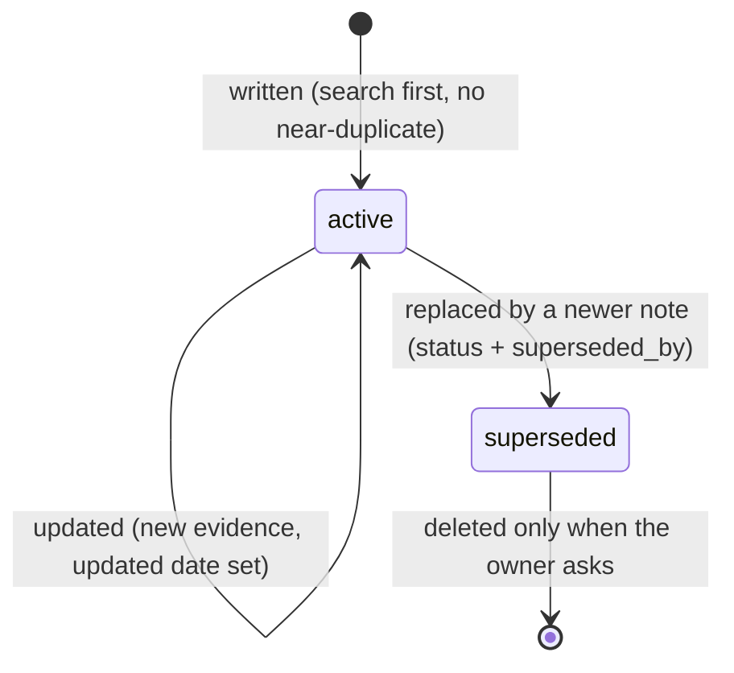

# Data model: the vault

**Status:** draft for approval (Discovery 2, 2026-10-04)

The vault is a folder of Markdown files in the private repo `mdsilcox/knowledge-vault-data`. The files are the only source of truth; basic-memory's SQLite index is derived and can be deleted and rebuilt at any time.

## Where things live
| What | Where |
|---|---|
| Vault (git clone of the data repo) on the PC | `E:\Backup Desktop\Claude Code Projects\knowledge-vault-data` (next to this project, on the backed-up drive) |
| basic-memory project | one project named `vault`, pointing at that folder; set as the default project |
| Search index | `~/.basic-memory/memory.db` (outside the vault, never committed) |
| Vault on the iPhone | Obsidian vault "Knowledge Vault", repo cloned into its `vault/` subfolder, read-only |
| Conventions, templates, skill, scripts | this repo (`mdsilcox/knowledge-vault`, public) |

## Folder layout (by type, with a project tag)
```
knowledge-vault-data/
  README.md            how the vault is organized (for the owner and for agents)
  .gitattributes       * text=auto eol=lf  (PC and phone agree on line endings)
  .gitignore           .obsidian/  .trash/  (each device keeps its own Obsidian settings)
  projects/            one hub note per project
  patterns/            reusable problem -> solution
  findings/            facts learned (tool behavior, limits, gotchas)
  decisions/           choices worth reusing (chosen, rejected, why)
  research/            survey summaries (question, options, verdict, sources)
  notes/               the owner's own notes
  reading/  journal/   later (not in v1)
```
A folder is created when its first note is written; empty folders are not committed.

## Note types
Every note has a type that sets its folder and its body sections. Body sections are a guide for Claude, not enforced; a short note is fine.

| Type | Folder | Holds | Body sections |
|---|---|---|---|
| `pattern` | `patterns/` | A problem that may recur and the fix that worked. The core type for "similar problems, similar solutions". | Problem, Cause, Solution, When it applies |
| `finding` | `findings/` | A fact learned: how a tool behaves, a limit, a measurement. | Finding, Evidence (source), Implications |
| `decision` | `decisions/` | A choice another project could reuse. | Context, Chosen, Rejected, Why |
| `research` | `research/` | The summary of a survey or comparison. Links to the findings it produced. | Question, Options compared, Verdict, Sources |
| `note` | `notes/` | Anything the owner asks to keep that fits nothing above. | free |
| `project` | `projects/` | Hub for one project: what it is, repo, and links to its notes. | What it is, Repo, Notes (list of links) |

## Frontmatter
```yaml
---
title: Windows path length breaks Python installs   # also the filename; unique in the vault
type: pattern                  # pattern | finding | decision | research | note | project
project: knowledge-vault       # slug of the source project, or "general" when it isn't tied to one
tags: [windows, python]        # lowercase, hyphenated topics; no project names (that's the project field)
created: 2026-10-04            # date only, YYYY-MM-DD
updated: 2026-10-04            # set on every edit after creation (optional until then)
status: active                 # active | superseded
source: docs/spike.md          # where it came from: a path in the project repo, a URL, or "chat"
superseded_by: "[[Newer note]]"  # only when status is superseded
permalink: vault/patterns/windows-path-length-breaks-python-installs  # added by basic-memory; never edited by hand
---
```
- Required: `title`, `type`, `project`, `tags` (may be empty), `created`, `status`.
- Hub notes (`type: project`) use the project slug as `project` and add `repo:` (URL or path).
- basic-memory adds `permalink` and rewrites `tags` as a block list the first time it indexes a note. We keep that behavior (`ensure_frontmatter_on_sync` stays on): it is a one-time, harmless change and gives every note a stable id. Claude writes through basic-memory's tools, so its own notes are already in that form.

## Names and links
- **Filename = title**, a short claim in sentence case that says the point: "Obsidian Git is unstable on iOS", not "iOS notes". No dates or project names in titles.
- **Links are `[[wikilinks]]` by title.** Obsidian, the graph view and basic-memory all resolve them.
- **Every note links to its project hub** (a `Project: [[knowledge-vault]]` line at the end), and the hub lists the note. This puts each project's knowledge in one cluster of the graph, while shared topics link across projects.
- **A "Related" line** links to notes that explain or depend on this one. Claude adds it when a search while writing turns up a close match.

## Lifecycle

- **Before writing, search.** If a note already covers it, update that note instead of adding a near-duplicate.
- **Wrong or outdated notes are superseded, not deleted**, so links keep working and the history stays readable.
- **Claude never deletes or moves notes without asking.**

## Sync
- Every write (create, edit, move) is committed and pushed straight away, one commit per write, message `vault: <created|updated|moved> <title>`. The phone pulls when the owner wants.
- The phone never pushes (read-only for now), so the PC never has to merge. If a push is rejected anyway, the PC pulls with rebase and retries once, then reports to the owner.

## Invariants (what the tests check)
1. Every note has the required frontmatter, and its `type` matches its folder.
2. Titles are unique; every wikilink resolves to an existing note.
3. Every non-hub note links to its project hub, and that hub exists.
4. No secrets: nothing that looks like a token, key or password (pattern scan on write and in CI).
5. Vault content never lands in the public tool repo.
6. Deleting `memory.db` and reindexing gives the same search results.

## What never goes in
Secrets (tokens, API keys, passwords), personal data beyond the owner's working preferences, whole transcripts or copies of project docs (link to them via `source` instead), and anything the owner marks private.

## How the vault relates to Claude Code's own memory
| | Per-project memory (`~/.claude/projects/.../memory/`) | The vault |
|---|---|---|
| Scope | one project | every project |
| Loaded | every session in that project (index) | only when searched |
| Holds | small habits, corrections, project state | distilled findings, patterns, decisions, research |
| Written | automatically by Claude | at the agreed writing moments |
A memory that turns out to matter beyond its project is promoted to the vault as a note; the memory stays as it is.

## A day in the life
1. **Research report.** In the Russian Trainer project, a researcher compares text-to-speech engines. At hand-back, Claude writes `research/Free offline TTS engines compared` (project `russian-trainer`, source `docs/research/tts.md`) and one `finding` per key fact ("Piper voices run on CPU in real time"). Each links to `[[russian-trainer]]`, and the hub gains the links. Each write is committed and pushed.
2. **A solved problem.** Later that day a build fails with a truncated install in a deep folder. After the fix, Claude searches the vault for "install truncated long path", finds `patterns/Windows path length breaks Python installs` from knowledge-vault, and adds the new case to it (an edit: `updated` set, a line under Solution, a link to `[[russian-trainer]]`). One pattern now spans two projects, and the graph shows the bridge.
3. **A decision.** At a phase gate, Russian Trainer picks SQLite over JSON files. Claude writes `decisions/SQLite over JSON files for app state` with context, chosen, rejected and why.
4. **Months later.** A new project needs speech output. When the stack phase starts, Claude searches "speech synthesis offline free", finds the research note and the Piper finding first (by meaning, though no word matches "speech synthesis"), reads them, and starts the comparison from there instead of from zero.
5. **On the phone.** On the train, the owner pulls in Obsidian, opens the graph, taps the russian-trainer hub, and reads the TTS comparison.

Walking this through added `source` (link back without copying), `superseded_by`, the hub link rule and the search-before-write rule.
